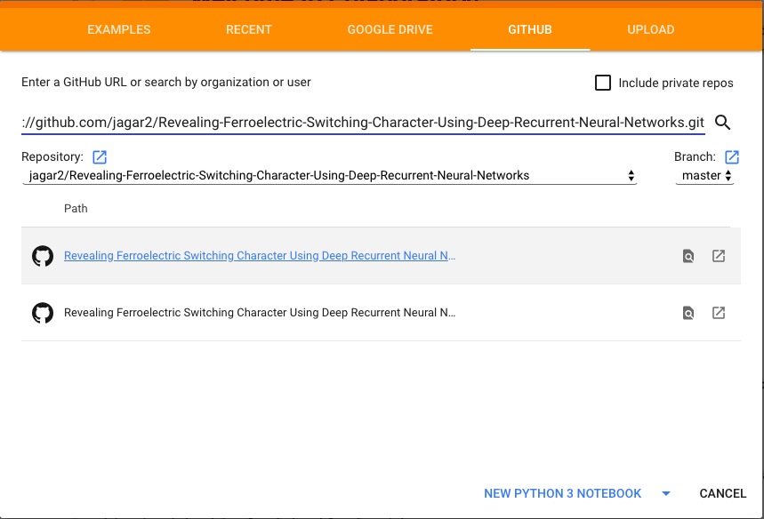
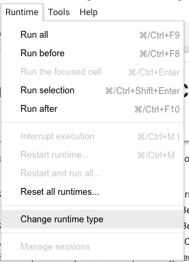
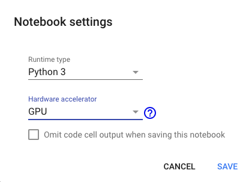

# Revealing-Ferroelectric-Switching-Character-Using-Deep-Recurrent-Neural-Networks
The ability to manipulate domains underpins function in applications of ferroelectrics. While there have been demonstrations of controlled nanoscale manipulation of domain structures to drive emergent properties, such approaches lack an internal feedback loop required for automatic manipulation. Here, using a deep sequence-to-sequence autoencoder we automate the extraction of latent features of nanoscale ferroelectric switching from piezoresponse force spectroscopy of tensile-strained PbZr0.2Ti0.8O3 with a hierarchical domain structure. We identify characteristic behavior in the piezoresponse and cantilever resonance hysteresis loops, which allows for the classification and quantification of nanoscale-switching mechanisms. Specifically, we identify elastic hardening events which are associated with the nucleation and growth of charged domain walls. This work demonstrates the efficacy of unsupervised neural networks in learning features of a material’s physical response from nanoscale multichannel hyperspectral imagery and provides new capabilities in leveraging in operando spectroscopies that could enable the automated manipulation of nanoscale structures in materials.

Note only the most important portions of the data are contained in the git repository, as some of the data sets (phase field, and training checkpoints) are very large (>30 gb). If these files are desired they can be dowloaded from: 

Phase field
https://zenodo.org/record/1482091/files/Phase_field.zip?download=1

Training data
https://zenodo.org/record/1482091/files/Trained_models.zip?download=1

1. Go to https://colab.research.google.com/
2. Select load from GitHub: https://github.com/jagar2/Revealing-Ferroelectric-Switching-Character-Using-Deep-Recurrent-Neural-Networks.git

3. Open Jupyter notebook Revealing Ferroelectric Switching Character Using Deep Recurrent Neural Networks-Collaboratory.ipynb

4. Change runtime type to include a GPU (this is only necessary to train new networks)

5. Run code by pressing `shift + enter` on cell blocks until prompted to provide authorization code. Follow onscreen instructions to link to google drive.

6. You can run scripts using `shift + enter`
 
